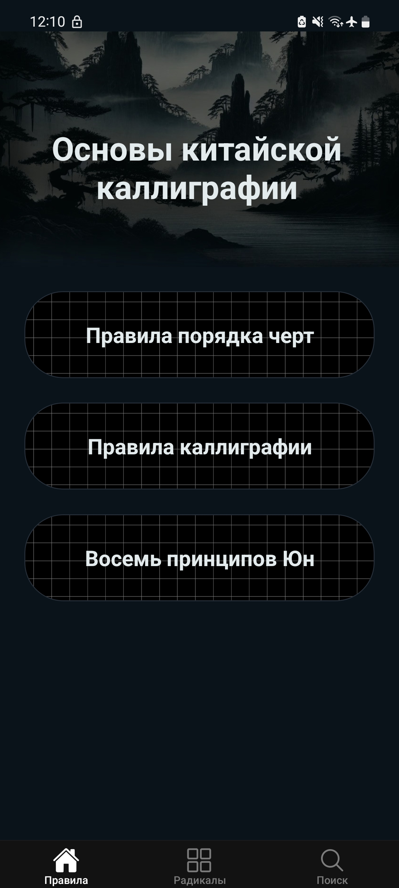
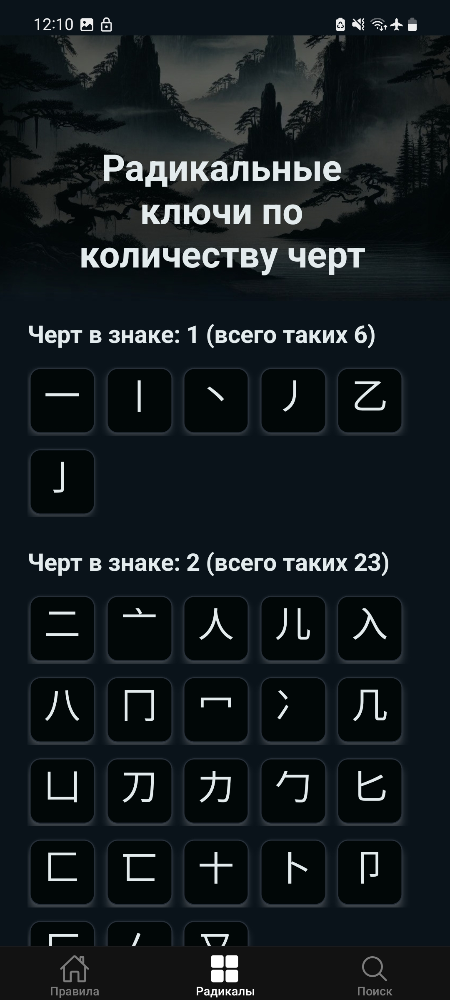
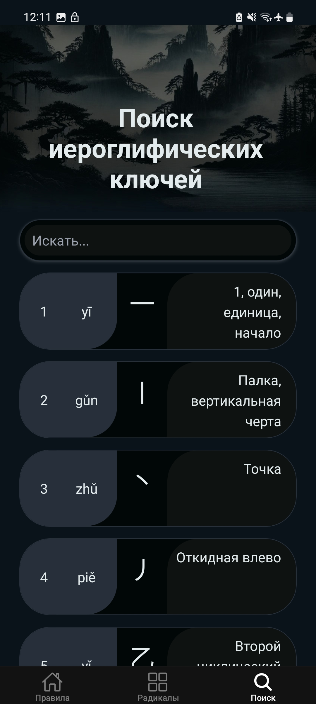

# Radical Keys 📱

A mobile application for learning Chinese characters using animation of writing characters, search, graphical etymology and historical script forms.

Built with React Native + Expo.

## Screenshots

| Home | Radicals | Search |
|------|------|------|
|  |  |  |

## ✨ Features

- 🖌 Chinese calligraphy fundamentals
- 🔢 Stroke order rules
- 🧭 The Eight Principles of Yong (永字八法)
- 🔍 Character search (by number, hanzi, stroke count, description)
- 🎬 Stroke order animations (SVG + GIF)
- 📚 Character etymology and historical evolution
- 🏺 Paleographic forms (Shuowen, Chu bamboo slips, Clerical script, etc.)
- 🔊 Text-to-speech pronunciation
- 📱 Offline-first storage
- 🌗 Automatic Dark/Light mode (syncs with device appearance settings)
- 🇷🇺 Russian UI

## 🛠 Tech Stack

- ⚛️ React 18 + React Native 0.76
- 🚀 Expo SDK 52
- 🧭 Expo Router (file-based navigation)
- 🎨 Reanimated + Gesture Handler
- 🖼 SVG + Expo Image
- 🌐 React Native Web
- 🧪 Jest + TypeScript

## 🧠 Architecture

- Expo Router (file-based navigation)
- Simple and clear folder structure
- Separation of UI (components), screens, and utilities
- Offline-first approach

## 🚀 Getting Started

### Prerequisites

- Node.js >= 18
- npm or yarn
- Expo CLI

1. Install dependencies

   ```bash
   git clone https://github.com/AkulichNV/radical-keys-react-native.git
   cd radical-keys-react-native
   npm install
   ```

2. Start the app

   ```bash
    npx expo start
   ```

In the output, you'll find options to open the app in a

- [Android emulator](https://docs.expo.dev/workflow/android-studio-emulator/)
- [iOS simulator](https://docs.expo.dev/workflow/ios-simulator/)
- [Expo Go](https://expo.dev/go), a limited sandbox for trying out app development with Expo

## 📂 Project Structure

- **app/** – Application screens using Expo Router (each file represents a route)
- **components/** – Reusable UI components shared across screens
- **context/** – Global state management via React Context
- **hooks/** – Custom reusable hooks
- **constants/** – Theme, colors, and configuration values
- **types/** – Centralized TypeScript types and interfaces
- **assets/** – Data, images, fonts, and sounds
- **scripts/** – Development and utility scripts

## 🗺 Roadmap

- [x] Character search (by number, hanzi, stroke count, description)
- [x] Light and dark themes
- [x] Stroke order animations (SVG + GIF)
- [ ] Add English and Romanian localization
- [ ] Chinese script styles
- [ ] Basic stroke reference table (simple & compound)
- [ ] Handwriting recognition

## 🤝 Contributing

Pull requests are welcome.
For major changes, please open an issue first.